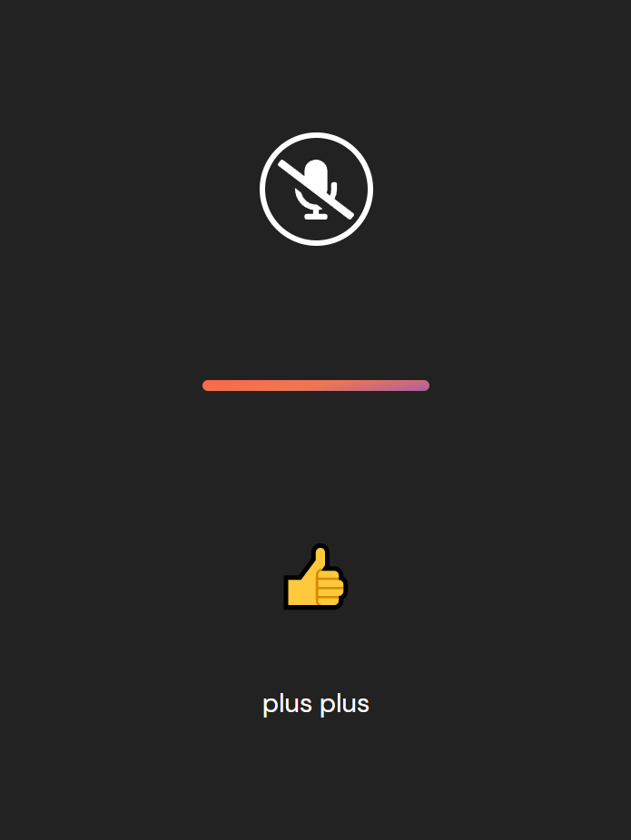

# Pyllustrator - Adobe Illustrator Assistant
* So, you are desingning a stunnning and magnificient artwork in Illustrator, but tired of moving your hand from the mouse to press keys, to activate specific functions like zoom in, zoom out, pen, save and many more of them..., then better call Python (& ofcouse JavaScript), unleashing the power of voice recognition & control your Illustrator by, your voice...

## 🌟 Features
* It comes with an interactive and responsive GUI which is at address **/assist**.
* It only listens to the commands, it is intended to, rest other commands are filtered out with visual feedbacks.
* If it detects silence, ie if your are not speaking anything after launching it, it will stop recognising automatically after few seconds.
* It listens to single commands as well as burst of commands (containing single trigger). Eg. will **zoom in 1x** for **plus** & will **zoom in 3x** for **plus plus plus**.
* To stop it, you can say ```terminate```.

## 📸 Screenshots
<p align="center">

<br/>


</p>

## 🔩 Requirements
* **pip3 install pyautogui** - for emulating keystrokes.
* **pip3 install flask** - for web server, to receive and process the commands.

## 🏃‍♂️ Run
* **python server.py** and go to **localhost:5000/assist**.
* Click on the mouse button and speak some of the following pre-implemented actions (with adobe illustrator in focus):
    * **plus** - zoom in *(shortcut : ctrl + =)*
    * **minus** - zoom out *(shortcut : ctrl + -)*
    * **save** - save your artwork *(shortcut : ctrl + s)*
    * **pick** - color picker tool *(shortcut : i)*
    * **tab** - enlarge/shrink workspace *(shortcut : tab)*
    * **select** - selection tool *(shortcut : v)*
    * **add your methods**

## 📝 Notes
* While this piece of code is specially designed for illustrator, you can change the keystrokes and implement it in your favourite application.
* After opening the mic (through the button), go to your application in which you want to see results. **Target application must be in FOCUS, not the web browser!!!**.
* Limitation - this supports as much platforms as your targetted application. e.g illustrator is only for Windows & MacOS. Although this can run on all, windows, MacOS & Linux, until & unless your targetted application is supported by them.
* **For MacOS** - swap the ```ctrl``` string with ```command```, and for all other keystrokes in file ```server.py```.
* **If you are adding your methods** - append the keyword, you want to support in ```adobeIllusFuncs``` array, in ```main.js``` file and update accordingly in ```server.py```.
* **Voice feedbacks** - you can also enable voice feedbacks with the help of ```SpeechSynthesis``` which is also provided by JS in the browser.
* works best in Google Chrome.

## ❕ Caution
* Permission to access microphone should be given to the webpage.
* The performance of this application solely depends upon the internet connection speed & your microphone quality.
* You can experience some delay between your command and keystrokes response, because this application uses **WEB SPEECH API**, which sends your voice sample on cloud, to get recognised and then it is sent back to your browser, & then all the remaining process happens locally, so proceed accordingly...

## 👾 External Sources
* And last but not the least, a huge shoutout to awesome folks at **fontawesome** and **vecteezy**, for their amazing graphical, and ready to use assets.